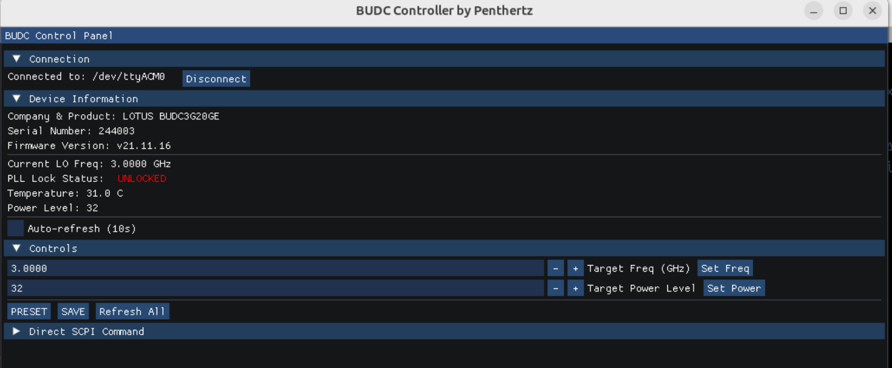

# BUDC Controller for Lotus Communication Systems devices

A cross-platform C application to control Lotus Communication Systems Block Up/Down Converters (BUDC) via serial port.

This project provides two interfaces:

1. `budc_cli`: A command-line tool for scripting and direct command execution.
2. `budc_gui`: A graphical user interface built with ImGui for interactive control.

---

## Features

* SCPI command communication for BUDC devices
* CLI for automation and scripting
* GUI with Dear ImGui for interactive control
* Cross-platform support: Windows and Linux (soon macOS)
* Build automation and Docker support
* Precompiled binaries released on GitHub for Windows and Linux
* Licensed under LGPL

---

## Prerequisites

* A C Compiler (GCC, Clang, MSVC)
* CMake (version 3.15 or newer)
* Git

---

## Dependencies

The project uses CMake's `FetchContent` to automatically download and build:

* [libserialport](https://sigrok.org/wiki/Libserialport): For serial communication
* [cimgui](https://github.com/cimgui/cimgui): C bindings for Dear ImGui
* [Dear ImGui](https://github.com/ocornut/imgui): The GUI library
* [GLFW](https://www.glfw.org/): Window and input handling
* [glad](https://glad.dav1d.de/): OpenGL function loader

---

## How to Build

### 🧬 Clone the repository

```bash
git clone https://github.com/Penthertz/lotus_budc_controller.git
cd lotus_budc_controller
```

### ⚙️ Configure with CMake

```bash
cmake -S . -B build
```

### 🛠️ Build the project

```bash
cmake --build build
```

On Windows with Visual Studio:

```bash
cmake --build build --config Release
```

The executables `budc_cli` (or `budc_cli.exe`) and `budc_gui` (or `budc_gui.exe`) will be located in the `build/src/` directory.

---

## How to Run

### CLI (`budc_cli`)

The CLI is used for sending single or scripted commands over a specified serial port.

**List available serial ports:**

```bash
./build/src/budc_cli --list
```

**Show help and available commands:**

```bash
./build/src/budc_cli --help
```

Example output:

```
BUDC Command Line Interface
Usage:
  budc_cli --list                           List available serial ports
  budc_cli --port <name> [COMMANDS]

Commands:
  --status              Get a full status report
  --cmd "<cmd>"           Send raw SCPI command
  --freq <ghz>          Set frequency in GHz
  --freq-hz <hz>        Set frequency in Hz
  --freq-mhz <mhz>      Set frequency in MHz
  --power <level>       Set power level
  --get-freq            Get current frequency
  --get-power           Get current power level
  --get-temp            Get temperature
  --get-lock            Get lock status
  --preset              Reset to preset values
  --save                Save settings to flash
  --wait-lock           Wait for PLL to lock (5s timeout) after a set command

Examples:
  budc_cli --port /dev/ttyACM0 --status
  budc_cli --port COM3 --freq 5.5
  budc_cli --port COM3 --freq 2.4 --wait-lock
```

**Example execution:**

```bash
budc_cli --port /dev/ttyACM0 --status
```

Output:

```
--- BUDC Status Report ---
  Identity:      LOTUS,BUDC3G20GE,244003,v21.11.16
  Serial Number: 244003
  Firmware:      v21.11.16
  Frequency:     2.2000 GHz
  Lock Status:   UNLOCKED
  Temperature:   51.0 C
  Power Level:   32
```

### GUI (`budc_gui`)



The GUI launches directly into an interactive window built with Dear ImGui:

```bash
./build/src/budc_gui
```

No command-line arguments are needed.

---

## Build Script

Instead of using Docker, this project includes a pre-configured build script for Linux environments.

### 🧪 Using `build_script.sh`

```bash
chmod +x build_script.sh
./build_script.sh
```

This script handles:

* Dependency checks
* Fetching sources
* Building both CLI and GUI
* Storing binaries under `build/`

---

## Precompiled Binaries

Tagged GitHub releases include precompiled binaries for:

* **Linux (x86\_64)**
* **Windows (x86\_64)**

👉 Download from the [Releases page](https://github.com/Penthertz/lotus_budc_controller/releases).

---

## License

This project is licensed under the **GNU Lesser General Public License (LGPL)**. See the [`LICENSE`](./LICENSE) file for details.

---
